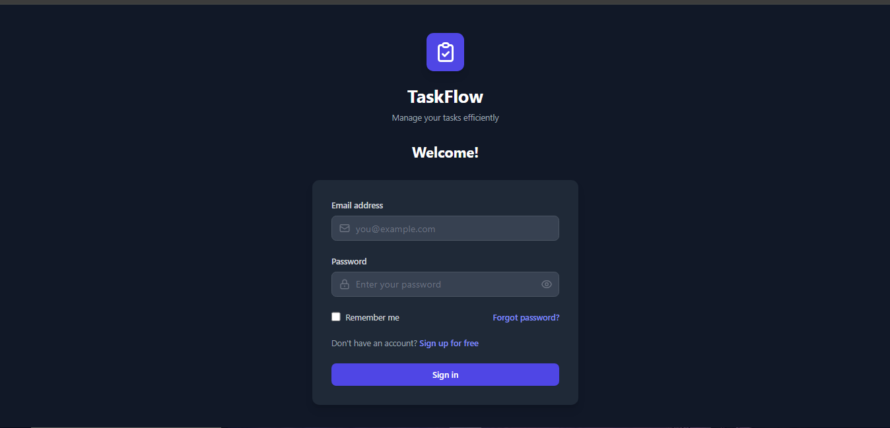
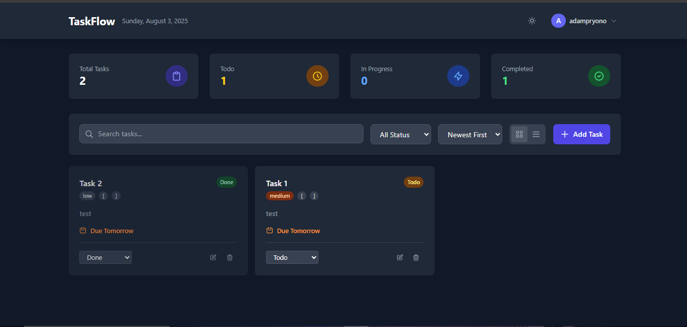
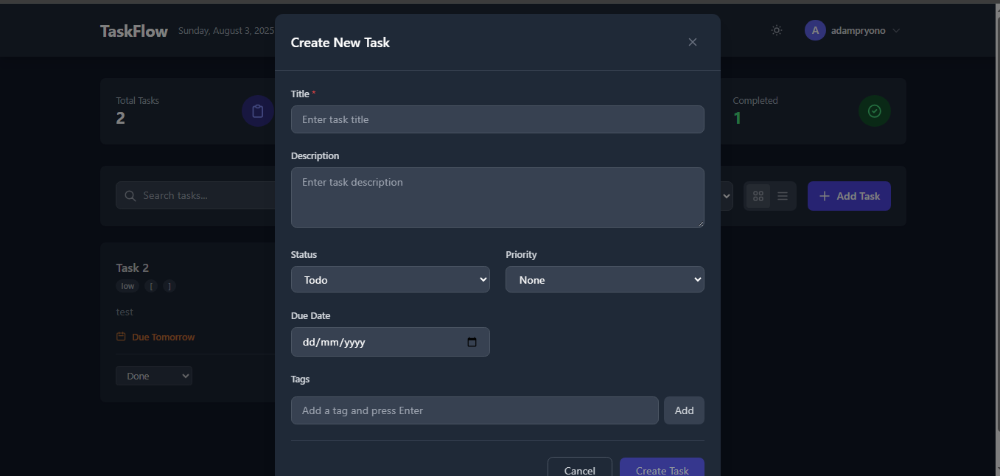

<div align="center">
  
  
  
  
</div>

<br />

<div align="center">
  <h1>🚀 TaskFlow - Modern Task Management Application</h1>
  <p>A beautiful, responsive task management application built with Vue.js 3 and Node.js</p>
</div>

<br />

<div align="center">
  
</div>

---

## 📸 Screenshots

<div align="center">
  <table>
    <tr>
      <td align="center">
        
        <br />
        <sub><b>Login Page</b></sub>
      </td>
      <td align="center">
        
        <br />
        <sub><b>Dashboard</b></sub>
      </td>
         <td align="center">
        
        <br />
        <sub><b>Task Management</b></sub>
      </td>
    </tr>
  </table>
</div>

## ✨ Features

<table>
  <tr>
    <td valign="top" width="50%">
      
### 🔐 Authentication & Security
- ✅ User Registration & Login
- ✅ JWT-based Authentication
- ✅ Secure Password Hashing
- ✅ Protected Routes
- ✅ Auto Logout on Token Expiry
      
### 📝 Task Management
- ✅ Create, Read, Update, Delete Tasks
- ✅ Task Status Management (Todo, In Progress, Done)
- ✅ Task Priority Levels
- ✅ Due Date Tracking
- ✅ Progress Tracking
- ✅ Task Tags & Categories
      
    </td>
    <td valign="top" width="50%">
      
### 🎨 User Interface
- ✅ Modern & Clean Design
- ✅ Dark Mode Support
- ✅ Fully Responsive
- ✅ Smooth Animations
- ✅ Toast Notifications
- ✅ Grid & List Views
      
### 🔍 Advanced Features
- ✅ Real-time Search
- ✅ Status Filtering
- ✅ Sort by Date/Priority
- ✅ Task Statistics
- ✅ User Profile Management
      
    </td>
  </tr>
</table>

## 🛠️ Tech Stack

<table>
  <tr>
    <td align="center" width="100">
      
      <br />Vue.js 3
    </td>
    <td align="center" width="100">
      
      <br />Node.js
    </td>
    <td align="center" width="100">
      
      <br />Express
    </td>
    <td align="center" width="100">
      
      <br />MySQL
    </td>
    <td align="center" width="100">
      
      <br />Tailwind
    </td>
    <td align="center" width="100">
      
      <br />Vite
    </td>
  </tr>
</table>

### Frontend
- **Framework**: Vue.js 3 (Composition API)
- **Build Tool**: Vite
- **Styling**: TailwindCSS
- **HTTP Client**: Axios
- **Routing**: Vue Router
- **State Management**: Vue Composables
- **Notifications**: Vue Toastification
- **Date Handling**: date-fns

### Backend
- **Runtime**: Node.js
- **Framework**: Express.js
- **Database**: MySQL
- **ORM**: Sequelize
- **Authentication**: JWT
- **Validation**: Express Validator
- **Security**: Bcrypt, CORS, Helmet

## 📋 Prerequisites

Before you begin, ensure you have the following installed:

- **Node.js** (v18.0.0 or higher) - [Download](https://nodejs.org/)
- **MySQL** (v8.0 or higher) - [Download](https://www.mysql.com/downloads/)
- **Git** - [Download](https://git-scm.com/)
- **npm** or **yarn** package manager

## 🚀 Installation

### 1️⃣ Clone the Repository

```bash
git clone https://github.com/yourusername/task-manager.git
cd task-manager
```

### 2️⃣ Install Dependencies

```bash
# Install root dependencies
npm install

# Install all dependencies (frontend & backend)
npm run install:all
```

### 3️⃣ Database Setup

1. Create MySQL database:
```sql
CREATE DATABASE task_manager;
```

2. Configure environment variables:
```bash
# Copy example env file
cp backend/.env.example backend/.env
```

3. Update `.env` with your database credentials:
```env
# Database Configuration
DB_HOST=localhost
DB_USER=root
DB_PASSWORD=yourpassword
DB_NAME=task_manager
DB_PORT=3306

# Server Configuration
PORT=5000
NODE_ENV=development

# JWT Configuration
JWT_SECRET=your-super-secret-jwt-key
JWT_EXPIRE=7d

# Frontend URL (for CORS)
FRONTEND_URL=http://localhost:3000
```

4. Run database migrations:
```bash
cd backend
npx sequelize-cli db:migrate
cd ..
```

### 4️⃣ Start Development Servers

```bash
# Start both frontend and backend
npm run dev

# Or start separately
npm run dev:backend  # Backend on http://localhost:5000
npm run dev:frontend # Frontend on http://localhost:3000
```

## 🏗️ Project Structure

```
📦 task-manager/
├── 📂 backend/
│   ├── 📂 config/         # Database configuration
│   ├── 📂 migrations/     # Database migrations
│   ├── 📂 seeders/        # Database seeders
│   ├── 📂 src/
│   │   ├── 📂 config/     # App configuration
│   │   ├── 📂 controllers/# Route controllers
│   │   ├── 📂 middleware/ # Express middleware
│   │   ├── 📂 models/     # Sequelize models
│   │   ├── 📂 routes/     # API routes
│   │   └── 📄 server.js   # Entry point
│   ├── 📄 .env            # Environment variables
│   └── 📄 package.json
├── 📂 frontend/
│   ├── 📂 public/         # Static assets
│   ├── 📂 src/
│   │   ├── 📂 components/ # Vue components
│   │   ├── 📂 composables/# Vue composables
│   │   ├── 📂 config/     # App configuration
│   │   ├── 📂 router/     # Vue Router
│   │   ├── 📂 views/      # Page components
│   │   ├── 📄 App.vue     # Root component
│   │   ├── 📄 main.js     # Entry point
│   │   └── 📄 style.css   # Global styles
│   ├── 📄 index.html
│   └── 📄 package.json
├── 📄 package.json        # Root package.json
└── 📄 README.md
```

## 📡 API Documentation

### Authentication Endpoints

| Method | Endpoint | Description | Auth Required |
|--------|----------|-------------|---------------|
| POST | `/api/auth/register` | Register new user | ❌ |
| POST | `/api/auth/login` | Login user | ❌ |

### Task Endpoints

| Method | Endpoint | Description | Auth Required |
|--------|----------|-------------|---------------|
| GET | `/api/tasks` | Get all user tasks | ✅ |
| GET | `/api/tasks/:id` | Get single task | ✅ |
| POST | `/api/tasks` | Create new task | ✅ |
| PUT | `/api/tasks/:id` | Update task | ✅ |
| DELETE | `/api/tasks/:id` | Delete task | ✅ |

### Request/Response Examples

<details>
<summary><b>POST /api/auth/register</b></summary>

**Request:**
```json
{
  "name": "John Doe",
  "email": "john@example.com",
  "password": "password123"
}
```

**Response:**
```json
{
  "success": true,
  "token": "eyJhbGciOiJIUzI1NiIs...",
  "user": {
    "id": 1,
    "name": "John Doe",
    "email": "john@example.com"
  }
}
```
</details>

<details>
<summary><b>POST /api/tasks</b></summary>

**Request:**
```json
{
  "title": "Complete project documentation",
  "description": "Write comprehensive docs",
  "status": "Todo",
  "priority": "High",
  "dueDate": "2025-08-10",
  "tags": ["documentation", "urgent"]
}
```

**Response:**
```json
{
  "success": true,
  "task": {
    "id": 1,
    "title": "Complete project documentation",
    "description": "Write comprehensive docs",
    "status": "Todo",
    "priority": "High",
    "dueDate": "2025-08-10T00:00:00.000Z",
    "tags": ["documentation", "urgent"],
    "userId": 1,
    "createdAt": "2025-08-03T10:00:00.000Z",
    "updatedAt": "2025-08-03T10:00:00.000Z"
  }
}
```
</details>


## 🧪 Testing

```bash
# Run frontend tests
cd frontend
npm run test

# Run backend tests
cd backend
npm run test
```


## 🙏 Acknowledgments

- [Vue.js Documentation](https://vuejs.org/)
- [TailwindCSS](https://tailwindcss.com/)
- [Express.js](https://expressjs.com/)
- [Sequelize ORM](https://sequelize.org/)

